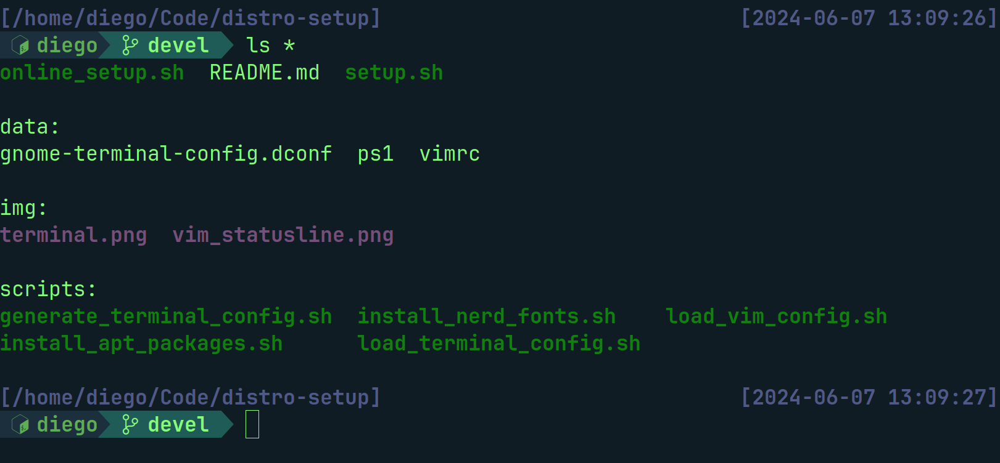

# Distro Setup

Scripts and config required for setting up my workspace. It's a combination of gnome-terminal and vim configuration and basic apt packages.
Taking inspiration from [pixegami/terminal-profile](https://github.com/pixegami/terminal-profile)

## Terminal



## Vim


# Run

Note: Tested on Ubuntu 22.04.

Launch the `./setup.sh` script as your user, not root. This will setup (my):
- basic apt packages
- gnome terminal shortcuts
- gnome terminal colors
- bash prompt
- vim configuration

**Note:** After installation, restart the terminal.

# Online execution

Since the setup is happening on a clean machine (where git is not installed), you can run the following command to have it all done in one line:

```
bash <(wget -qO- https://raw.githubusercontent.com/drabaioli/distro-setup/main/online_setup.sh)
```

**Note:** After installation, restart the terminal.

# Generate terminal configuration

On a pre-configured gnome-terminal you can use the `./scripts/generate_terminal_config.sh` script to generate a dump of the configuration to be imported into another machine.

# Vim statusline and bash prompt

This is achieved through simple configuration. Powerline was not used.
